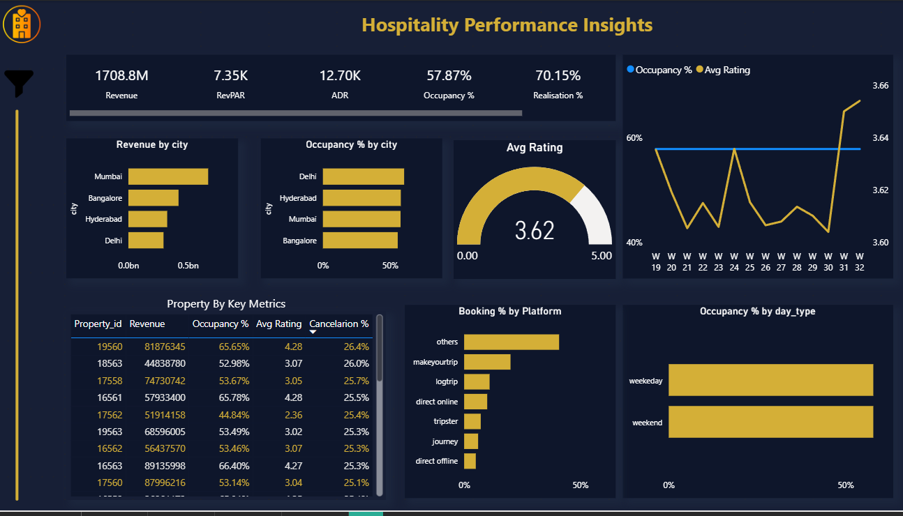

# Hospitality Performance Insights Dashboard

## Project Overview

This project analyzes hospitality industry performance using Power BI.
The dashboard provides insights into revenue, occupancy, customer ratings, and booking platforms.

## Dashboard Preview

## Key KPIs

* Total Revenue
* RevPAR (Revenue per Available Room)
* ADR (Average Daily Rate)
* Occupancy %
* Realisation %

## Dashboard Insights

* Revenue by city
* Occupancy rate by city
* Customer rating trends
* Booking percentage by platform
* Property performance metrics
* Weekday vs Weekend occupancy  

## Tools Used

* Power BI
* Excel
* DAX
* Data Visualization

## Dashboard Demo

https://github.com/yourusername/repo-name/assets/video-file-link

## Author

Yogesh 
Data Analytics Enthusiast
